# Traffic-sign-detection

## Introduction

This repository is an implementation of two models from ["Traffic sign detection based on classic visual recognition models"](https://iopscience.iop.org/article/10.1088/1742-6596/2646/1/012024) paper in `pytorch` library. We trained a two-stage and a one-stage detector model for traffic sign detection. The two-stage detector is based on Faster R-CNN and the one-stage detector is based on SSD300. The dataset used is [GTSDB(German Traffic Sign Detection Benchmark)](https://www.kaggle.com/datasets/safabouguezzi/german-traffic-sign-detection-benchmark-gtsdb).

## Task

The task is to detect traffic signs in an image and determine the kind of traffic sign. The dataset contains 900 images with 1213 traffic signs. The traffic signs are classified into 4 classes: 

* Prohibitory
* Mandatory
* Danger
* Other

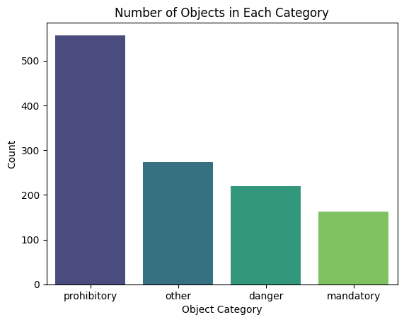

We also categorized each traffic sign into 3 classes based on their size to analyze the performance of the models on different sizes of traffic signs. The 3 classes are:

* Small
* Medium
* Large

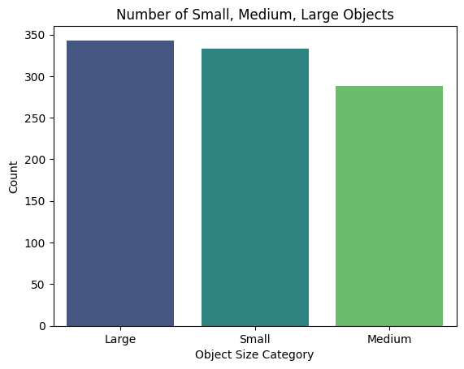

These are three sample image with ground truth bounding boxes and classes:

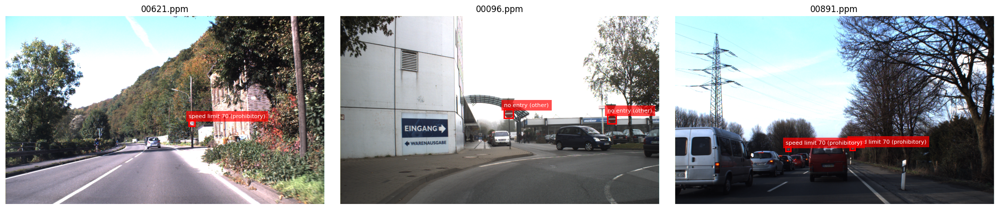

## Models

### Faster R-CNN

The Faster R-CNN model is an advanced object detection framework that operates in two stages for high accuracy. In the first stage, a Region Proposal Network (RPN) processes the input image using a Convolutional Neural Network (CNN) backbone to extract features. It then employs a sliding window approach to identify potential regions (candidates) where objects might be located. In the second stage, these candidate regions are fed into a separate network that classifies the objects within them and refines their bounding box predictions. This two-stage design separates region proposal and object classification tasks, allowing for precise and efficient detection by performing each step independently yet in coordination.

To enhance its performance, Faster R-CNN often uses a ResNet-50 backbone integrated with a Feature Pyramid Network (FPN). ResNet-50, a 50-layer deep residual network, leverages residual connections to directly pass information from earlier layers to later ones, mitigating the vanishing gradient problem and improving training for deep architectures. Meanwhile, FPN enhances object detection across various scales by combining a bottom-up pathway with lateral connections, merging high-resolution, detailed features from lower layers with semantically rich features from higher layers. This ResNet-50-FPN combination empowers Faster R-CNN to extract complex, high-quality features and detect objects of different sizes effectively, maintaining efficiency while excelling in challenging scenarios.

    

### SSD300

The SSD300 (Single Shot MultiBox Detector) is a single-stage object detection model designed to identify and localize objects in images efficiently. Unlike two-stage models like Faster R-CNN, which first propose candidate regions and then classify them, SSD300 directly predicts object classes and bounding boxes from image features in one pass, eliminating the need for additional region proposal or post-processing steps. This makes SSD300 faster and more computationally efficient. Built on the VGG16 architecture—a deep convolutional neural network with 16 layers—SSD300 extracts multi-scale features from the image, enabling it to detect objects of varying sizes effectively. VGG16 serves as a robust feature extractor, providing high-quality, complex features with a simple yet deep structure, allowing SSD300 to perform simultaneous detection and localization with high accuracy and speed, making it ideal for real-time applications.

## Results

### Faster R-CNN

We trained two models. One with freezing the backbone and one without freezing the backbone. 

#### Freezing the Backbone

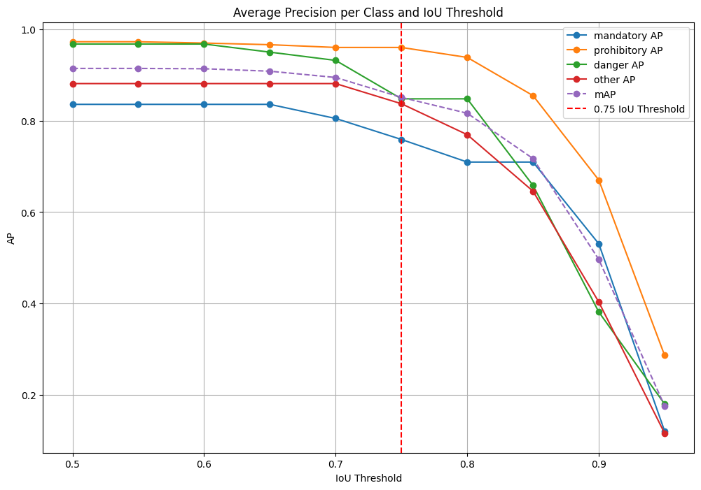

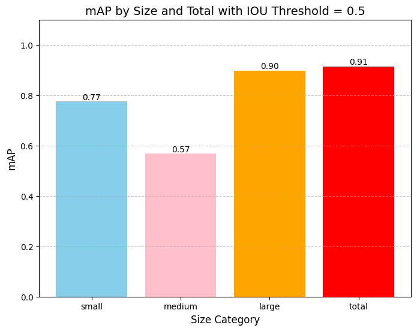

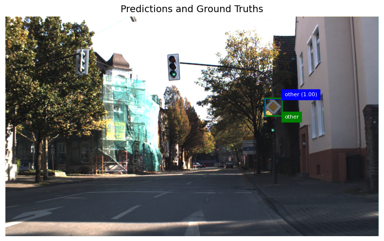

#### Training the Backbone

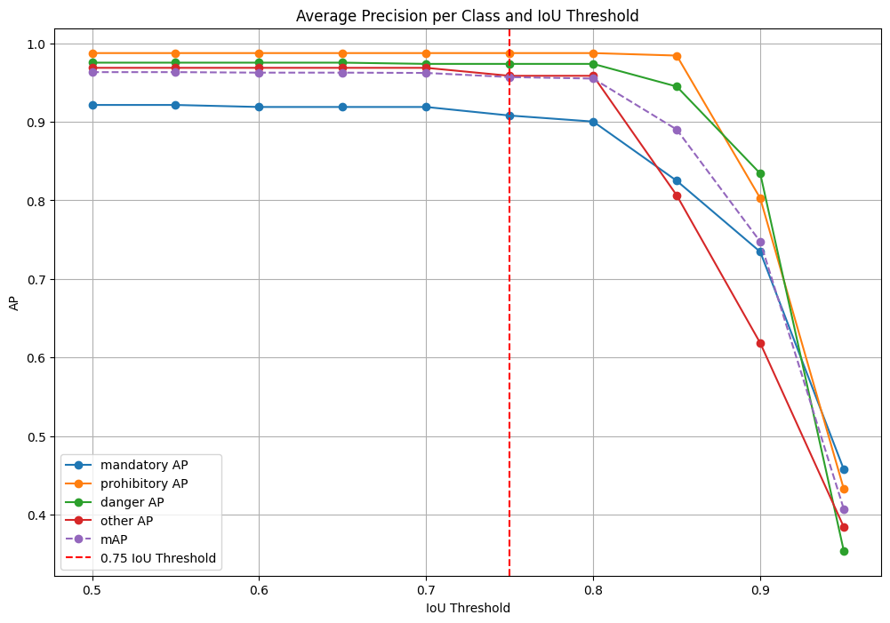
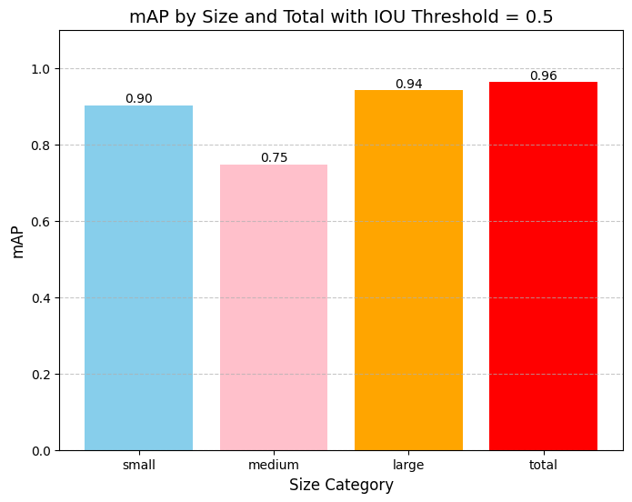
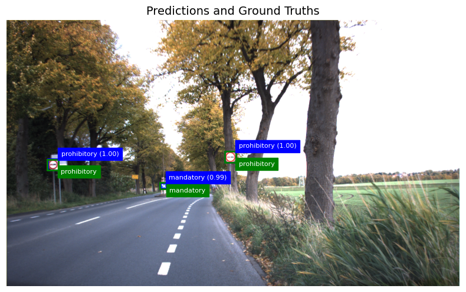

### SSD300

We froze the backbone of the SSD300 model. SSD300 result was not as good as Faster R-CN but the training and inference time was much faster.

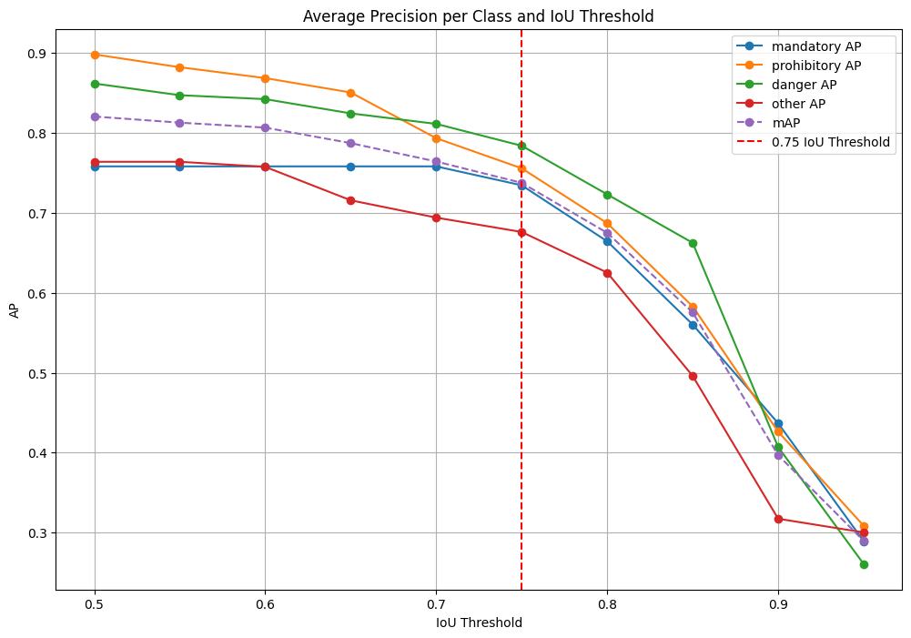
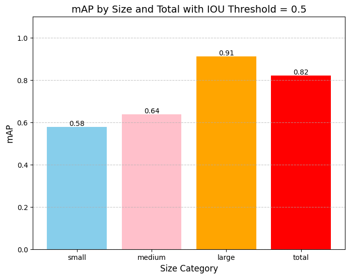
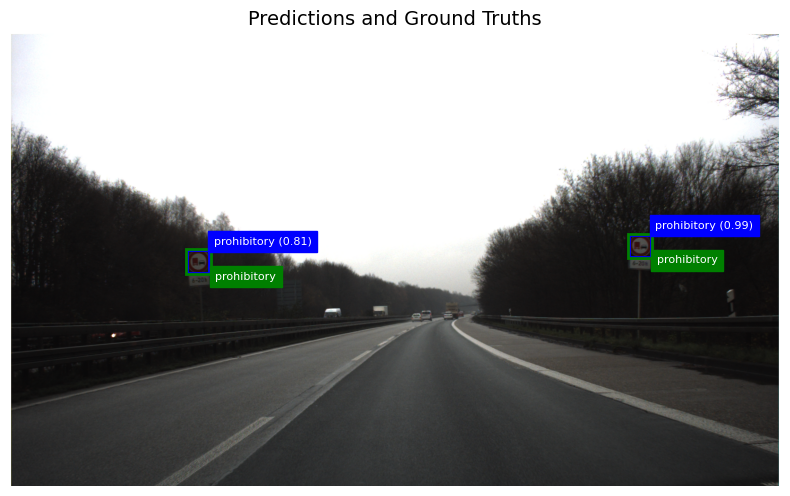

## Contributors
* [Ali Hamzehpour](https://github.com/AliHamzeh2002)
* [Mina Shirazi](https://github.com/meenashrz)